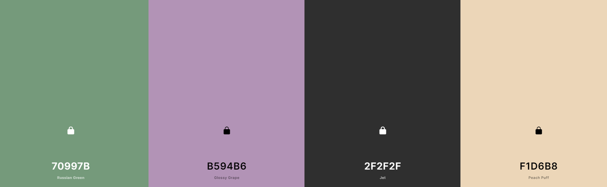
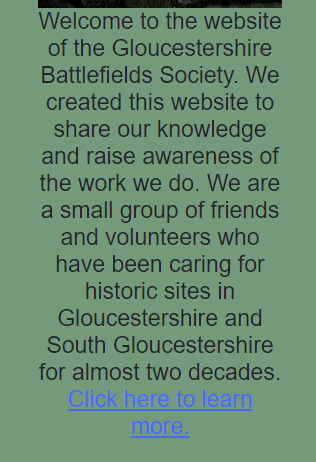

# Gloucestershire Battlefields

https://james-vt.github.io/MS2_Gloucestershire_Battlefields/

# Project overview

This website serves as the main page of a small, charitable organisation that looks after, researches and provides information on sites of historical military significance in Gloucestershire and neighbouring areas. The aims of the site owners are to relay information on battles and battlefields, provide information to site visitors about which sites they can visit and how to do so, and to generate revenue through donations. A visitor to the site will want to learn information about the county's military history and its significant sites, which ones they can visit and how to do so, and will potentially want to donate after a good experience.

---

# UX
The primary aim of the Gloucestershire Battlefields website is information - for the site owners, it is to relay information while for the site users, it is to obtain information. A user will want to see the range of battlefields across the county and learn about them - possibly with a view to visiting one or more of them - and will want to select which ones to learn information about. The site owners will want to provide a positive experience for the users in order to raise awareness of the sites they look after, and potentially to raise revenue via donations.

## User stories
### A visitor to the site will want to:
1. Learn the history of a specific battlefield chosen by interacting with the map.
2. Select a specific battlefield on the interactive map or from the button menu in order to see information about it feed back on the page.
3. Contact the organisation behind the website, and receive confirmation that their correspondence has been sent.
4. Test their knowledge with a quiz they can initiate on the subject that feeds back their score.
5. Review their answers to the quiz via feedback, to see where they went wrong if applicable.

### A site owner will want to:
6. Relay information about the battlefields the charity promotes according to user input.
7. Visually display the locations of battlefields on the interactive map according to user input.
8. Provide the opportunity for visitors to contact the charity via an interactive feedback form.
9. Present visitors with a fun and working interactive quiz that feeds back their results.
10. Relay to visitors the purpose and nature of the charity.

# Design choices

Here I will explain my choices.

# The Five Planes of User Experience Development
As part of the planning for this project, I have run through the stages of User Experience Design, as proposed by Jesse James Garrett.

## The Strategy plane
Beginning with the strategy plane, considered who might use this website and why; both site visitors and site owners. The goal of the site owners is to raise awareness of battlefields and sites of historical military significance within Gloucestershire and the surrounding area, and potentially to generate some revenue via donations. Visitors come to the site because they want to learn about specific battlefields and parts of history.

## The Scope Plane
The project's scope is chiefly threefold: the primary objective is the exchange of information about Gloucestershire's battlefields between site owner and site user. The second is the raising of revenue for the charity via donations, but this is achieved off the back of the first objective. The third is the relaying of information about the charity themselves.

## The Structure Plane
My wireframes can be found below. These have been constructed with the idea that mobile design should come first, and that the main aim from the point of the view of the site owner is the relaying of information in an interactive fashion that presents the basic facts, a narrative of the events, and the location on a map.

## The Skeleton Plane
The site's information is structured in such a way as to make the map primary; it is the first thing a user will see upon loading the page, and the cascading information resulting from clicking a button or location of a battle appears underneath the map itself. The difference at smaller screen sizes may be (depending on the precise size) the changing of the layout of the buttons. 

## The Surface Plane
TODO

## Colour scheme

* Russian Green #70997B
* Glossy Grape #B594B6
* Jet #2F2F2F
* Peach Puff #F1D6B8

I have made these choices based on the recommendations of Coolors' system after seaching for colours to match Russian Green, a colour I decided on early on. Although pink may seem a weird colour for a website on military history, the territory of the British Empire was coloured pink on maps so I decided to stick with that particular suggestion. Jet's a sleek choice that pairs well with pretty much anything, even moreso than black for not being as dark. Finally, Peach Puff seemed an appropriate colour to use for a site about the history of a county in which a great many houses are built from the local limestone, which is this colour.

# Deployment
 Here I'll explain how to deploy/how I deployed the website to GitHub and how to run it locally. 

### Deploying a static project to GitHub pages:
 1. You'll need a GitHub account, if you don't already have one. Head to their site https://github.com and you'll see the sign-up links straightaway on the home page. Google Chrome is the recommended browser for GitHub.
 2. Once you're signed-up, this'll be your landing page.
 3. Click on the user icon in the top right corner of the screen. This opens a dropdown menu. Click "Your repositories."
 4. You'll then see a list of your repositories.
 5. In the list of repositories, click the repository you want - in this case, Gloucestershire Battlefields.
 6. Then, from the bar along the top (not the nav bar - lower, under the repo name) click Settings.
 7. On the Settings page, click "Pages" from the left-hand menu.
 8. In the Pages options, before you've deployed, your "Branch" under "Source" will have a default value of none. Click this, then set it to Main or Master depending on the version you're using. Mine, having been already deployed, says Master and yours will too when deployed, but ignore that discrepancy for now.
 9. Click Save.
 10. The page will refresh, and you'll see it change to say "Your site is ready to be deployed at "https://username.github.io/repository-name/"
 11. Be aware this deployed site will take a few minutes to deploy, usually about ten. Be patient and don't click while it's building as that can slow it down.
 12. Click the link to make sure it works after a suitable wait. Et voila, you've deployed the site!

### Forking the repository for your own use
This creates a copy of the repository for editing or viewing without affecting my (original) version. If you want to do it, do this:
1. You'll need a GitHub account. Go to https://github.com to make one.
2. Locate the repository (this one). At the top right of the page, beneath my pink and white avatar, you'll see the Fork button. Click it.
3. This should add a version for you to use in your own repository. Have fun with it!

### Cloning the repository
Another way of getting your own local version to work on is to clone the repository. Below are the steps.
1. You'll need a GitHub account. Go to https://github.com to make one.
2. Locate the repository (this one).
3. Click Code, the button just to the left of the green GitPod button.
4. Click HTTPS to make sure you're in it, then copy the link you see there.
6. Head into GitPod or your IDE of choice, and open up the terminal.
5. Switch your working directory to the location you want to the cloned directory created.
6. Then you want to type "git clone https://github.com/James-VT/MS2_Gloucestershire_Battlefields", the same URL as before.
7. Hit Enter. You're good to go!

# Features

* ## Intro text w/ optional extra text
    * As an early bit of JQuery for my project, I spotted an opporunity to give the user the option not to have to have all of the intro text on the screen. On smaller devices, it's quite a lot of information and, attention spans being what they are, it might put people off the site. As a result, the bare essentials are there with an option to click for the rest of the intro. A first time user who is really interested would probably click this, while a returning user might have already read it and so not need to, and instead move on to the links below.

    User story goal achieved by this feature | How was this achieved?
    --- | ---
    10 Relay to visitors the purpose and nature of the charity. | The into text provides a first impression of the organisation behind the website, informing a visitor of what the site is for and the things they can do on it.

# Technologies used

## Languages:
* [HTML5](https://en.wikipedia.org/wiki/HTML5) was used for the content and structure of the site.
* [CSS3](https://en.wikipedia.org/wiki/CSS#CSS_3) was used for the styling of the site.
* [JavaScript](https://en.wikipedia.org/wiki/JavaScript) was used for the interactivity of the site.

## Balsamiq
Balsamiq was used to create the wireframes for this project. [Balsamiq](https://balsamiq.com/)

## Bootstrap
Bootstrap 5 was used for some HTML component templates and CSS styling. [Bootstrap 5.](https://getbootstrap.com/docs/5.0/getting-started/introduction/)

## Git
Git was used for version control and saving work in the repository, using the GitPod extension in Google Chrome to commit to GitHub. [Git](https://git-scm.com/)

## Google Chrome
This project was created in the Google Chrome browser, and as such Chrome was used as the default testing browser. [Chrome](https://www.google.com/intl/en_uk/chrome/)

## Google Fonts
The fonts for the site were imported from Google Fonts. [Google Fonts](https://fonts.google.com/)

## FontAwesome
The icons for social media links were taken from FontAwesome. [FontAwesome](https://fontawesome.com/)

## Coolors
The colour palette for this site was chosen using Coolors. [Coolors](https://coolors.co/)

## JQuery
JQuery is used in this project via CDN to provide the option of simplifying JavaScript code. [JQuery](https://jquery.com/download/#using-jquery-with-a-cdn)

## GeoHack
GeoHack is a service I've used via Wikipedia to source the coordinates for the battlefields in order to place the map markers correctly. [GeoHack](https://geohack.toolforge.org/)

## JSHint
JSHint is a free JavaScript testing programme, used to look for errors in the sites various JS files. [JSHint](https://jshint.com/)

## favicon
Favicon was used to create the icon for this site. [favicon](https://favicon.io/favicon-generator/)

# Credits

## Wikipedia
Wikipedia was used extensively for this project. Links to specific pages from which information or text was taken are below.

### Tewkesbury battle information
The information about the Battle of Tewkesbury used for this site was taken from the battle's [wikipedia page.](https://en.wikipedia.org/wiki/Battle_of_Tewkesbury)

### Battle of Crickley Hill information
The text for the battle of Crickley Hill came partly from [historyextra.com.](https://www.historyextra.com/period/roman/what-earliest-evidence-battle-britain-first-conflict-ever/) A little more was added by me.

### Beverston Castle information
The text for Beverston Castle came partly from the castle's [wikipedia page.](https://en.wikipedia.org/wiki/Beverston_Castle)

### Battle of Stow on the Wold information
The information about the Battle of Stow on the Wold used for this site was taken from the battle's [Wikipedia page.](https://en.wikipedia.org/wiki/Battle_of_Stow-on-the-Wold)

### Battle of Deorham information
The information about the Battle of Deorham used for this site was taken from the battle's [Wikipedia page.](https://en.wikipedia.org/wiki/Battle_of_Deorham)

### Battle of Nibley Green information
The information about the Battle of Nibley Green used for this site was taken from the battle's [Wikipedia page.](https://en.wikipedia.org/wiki/Battle_of_Nibley_Green)

# Image credits
* beverstonetoday.jpg is taken from Wikimedia commons, and is open-source. [Link](https://commons.wikimedia.org/wiki/File:Beverston_castle.jpg) The original uploader was Anlace at English Wikipedia., CC BY-SA 2.5 <https://creativecommons.org/licenses/by-sa/2.5>, via Wikimedia Commons

* henryiii.jpg is taken from Wikimedia commons, and is open-source. [Link](https://commons.wikimedia.org/wiki/File:HenryIII.jpg) Attribution: AnonymousUnknown author, Public domain, via Wikimedia Commons

* musketvolley.jpg is taken from Wikimedia commons, and is open-source. [Link](https://commons.wikimedia.org/wiki/File:Musket_volley_by_Sealed_Knot.JPG) Attribution: Charlesdrakew, Public domain, via Wikimedia Commons

* ghent.jpg is taken from Wikimedia commons, and is open-source. The original is a period manuscript. [Link](https://commons.wikimedia.org/wiki/File:MS_Ghent_-_Battle_of_Tewkesbury.jpg) Attribution: Tewkesbury1.jpg: Unknownderivative work: Jappalang, Public domain, via Wikimedia Commons

* sanctuary.jpg is taken from Wikimedia commons, and is open-source. [Link](https://commons.wikimedia.org/wiki/File:Richard_Burchett_-_Sanctuary_(1867)_contrasted.jpg) Attribtion: Guildhall Art Gallery, Public domain, via Wikimedia Commons

* reenactment.jpg is taken from Wikimedia commons, and is open-source. [Link](https://commons.wikimedia.org/wiki/File:Battle_of_Tewkesbury_reenactment_-_fighting_while_arrows_fly.jpg) Attribution: Antony Stanley, CC BY-SA 2.0 <https://creativecommons.org/licenses/by-sa/2.0>, via Wikimedia Commons

* crickleytoday.jpg is taken from Wikimedia Commons, and is open-source. [Link](https://commons.wikimedia.org/wiki/File:View_from_Barrow_Wake_towards_Crickley_Hill_-_geograph.org.uk_-_986696.jpg) Attribution: Sarah Charlesworth / View from Barrow Wake towards Crickley Hill

* flintaxe.jpg is taken from Wikimedia Commons, and is open-source. [Link](https://commons.wikimedia.org/wiki/File:Feuersteinaxt.jpg) Attribution: Dr. Henning Krämer, Geesthacht  - de:User:Hinnerk, CC BY-SA 3.0 <http://creativecommons.org/licenses/by-sa/3.0/>, via Wikimedia Commons

* stoneage.jpg is taken from Wikimedia Commons, and is open-source. [Link](https://commons.wikimedia.org/wiki/File:Stone-age-painting.jpg) Attribution: Gugatchitchinadze, CC BY-SA 4.0 <https://creativecommons.org/licenses/by-sa/4.0>, via Wikimedia Commons

* 512pxkingalfred is taken from Wikimedia Commons, and is open-source. [Link](https://commons.wikimedia.org/wiki/File:King_Alfred_the_Great_statue,_Wantage,_Oxfordshire.jpg) Attribution: Philip Jelley Philipjelley, CC BY-SA 3.0 <https://creativecommons.org/licenses/by-sa/3.0>, via Wikimedia Commons

* 512pxrepincossacks.jpg is taken from Wikimedia Commons, and is open-source. [Link](https://commons.wikimedia.org/wiki/File:Repin_Cossacks-v.jpg) Attribution: Ilya Repin (1844-1930), Public domain, via Wikimedia Commons

* 512pxkinghenryv.jpg is taken from Wikimedia Commons, and is open-source. [Link](https://commons.wikimedia.org/wiki/File:King_Henry_V_of_England_at_the_Battle_of_Agincourt,_1415.jpg) Attribution: Unknown authorUnknown author, Public domain, via Wikimedia Commons

* 512pxmontgomerycastle.jpg is taken from Wikimedia Commons, and is open-source. [Link](https://commons.wikimedia.org/wiki/File:Montgomery_Castle_and_view_of_the_castle_tower_ruins_Montgomery,_Powys.jpg) Attribution: Rosser1954, CC BY-SA 4.0 <https://creativecommons.org/licenses/by-sa/4.0>, via Wikimedia Commons

* foolshead.jpg is an image displayed at the American Museum & Gardens. [Link](https://artuk.org/discover/artworks/fools-head-world-map-271600). It is believed to have been created c.1590. Its artist is unknown.

* assets/images/indeximages/horseman.jpg is taken from Wikimedia Commons, and is open-source. [Link](https://commons.wikimedia.org/wiki/File:Portrait_of_a_Horseman_MET_DP169220.jpg)  Attribution: James Seymour, CC0, via Wikimedia Commons.

### Tutorials

[Build A Quiz App With JavaScript](https://www.youtube.com/watch?v=riDzcEQbX6k&t=379s) from the channel Web Dev Simplified was extremely helpful for the creation of the site's quiz. I have edited the code heavily while building the quiz in quiz.js but I begun by taking some ideas from that tutorial and building from there.

### Wireframes

The wireframes developed for this project can be found [here](assets/milestone2wireframes.pdf). They were built using Balsamiq (credit in Technologies section).