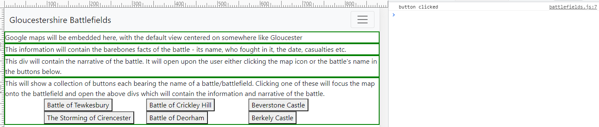
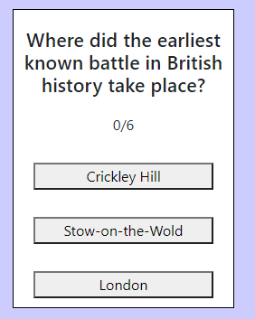
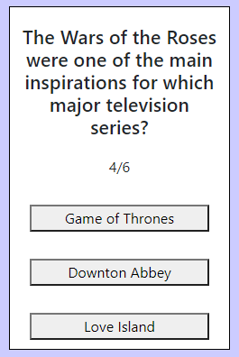
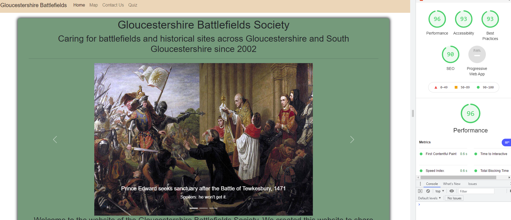
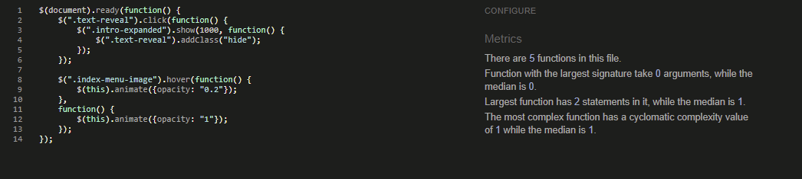
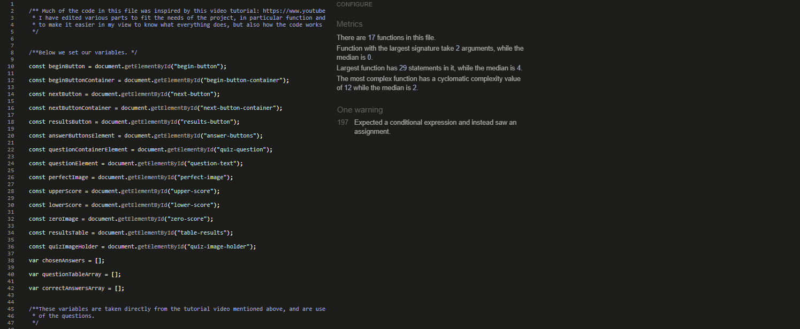

# Testing

### Linked script testing

As you can see in the picture, the first function in my site that I tested was whether the buttons registered a click properly. This was partly to test the buttons themselves, but also to test whether I had correctly linked my JavaScript file to my index.html file. As such, I wrote the code below in battlefields.js:

```
// The below is to test whether this file in linked properly to the index.html file
// and its button elements

let button = document.getElementById("tewkesbury-button");

function buttonTest() {
    console.log("button clicked");
}

button.addEventListener('click', buttonTest);
```

As you can see from the image below, the test was successful.



## Testing against user stories

I have tested each user story against the various features of the site to ensure that each of them are met in some way.

### First time user stories:

User Story Number | A first time user will want to: | How was this achieved? | Evidence
------ | ------ | ------ | ------
1 | Learn the history of a specific battlefield chosen by interacting with the map. | Clicking the map buttons or functions will feed information onto the page relevant to the selection. | (evidence image here)
2 | Change the clicked battlefield on the interactive map or from the button menu in order to see information about it feed back on the page, while removing the information from the previous selection. | Selecting a different battlefield will remove the previous selection's info, and fed the new selection's info onto the page. | (evidence image here)
3 | Contact the organisation behind the website, and receive confirmation that their correspondence has been sent. | The contact form facilitates contact between visitors and site owners, and feeds back to confirm successful receipt of correspondence. | (evidence image here)
4 | Test their knowledge with a quiz they can initiate on the subject that feeds back their score. | The quiz is accessed via links in the nav bar and the index page image menu. The quiz itself feeds back user score throughout. | [Quiz question](assets/images/testing/userstorytesting/userstoryquizexample.png), [quiz answer feedback](assets/images/testing/userstorytesting/userstoryanswerfeedback.png)
5 | Review their answers to the quiz via feedback, to see where they went wrong if applicable. | A table of results and correct answers is presented to the user at the end of the quiz. | [Results table](assets/images/testing/userstorytesting/userstoryresults.png)

------
### Site owner stories:

User Story Number | A site owner will want to: | How was this achieved? | Evidence
------ | ------ | ------ | ------
6 | Relay information about the battlefields the charity promotes according to user input. | Map page reveals info depending on user selection. | (evidence image here)
7 | Visually display the locations of battlefields on the interactive map according to user input. | Clicking one of the buttons with the battlefields' name on it will pan the map to that location. | (evidence image here)
8 | Provide the opportunity for visitors to contact the charity via an interactive feedback form. | Contact form allows site owners to receive communication from visitors. | (evidence image here)
9 | Present visitors with a fun and working interactive quiz that feeds back their results. | The quiz presents a user with results at the end, keeps score and presents them with "correct" or "wrong" for each answer given, depending. | [Wrong answer and score](assets/images/testing/userstorytesting/userstoryanswerfeedback.png), [results](assets/images/testing/userstorytesting/userstoryresults.png)
10 | Relay to visitors the purpose and nature of the charity. | Information is presented to the user upon landing on the home page, with an option to read more upon interacting with the page. | [Home page intro with optional extra info](assets/images/testing/userstorytesting/userstoryindex.png)

---

## Bugs

### Race condition bug

A bug I faced when working with the Google Maps API was due to what I later learned was a "race condition." When loading the live page or the port 8000 test page, the map would show on some page loads but not others. When the map failed to load, I noted the following two errors in the console:

```
Uncaught ReferenceError: google is not defined
    at myMap (battlefields.js:40)
    at battlefields.js:53
```

```
Uncaught (in promise) hf {message: "initMap is not a function", name: "InvalidValueError", stack: "Error\n    at new hf (https://maps.googleapis.com/m…yZ-4&callback=initMap&libraries=&v=weekly:160:155"}
```

Thinking at first that this was to do with the restrictions on the API key, I first tried changing those, but this did not work. I then consulted fellow CI students on Slack, which turned up an interesting result. Below is my original HTML code for the Google Maps API:

```
<script
      src="https://maps.googleapis.com/maps/api/js?key=YOUR_API_KEY&callback=initMap&libraries=&v=weekly"
      async
    ></script>
```

As identified by fellow student Sean Young, the attribute of "async" at the end of the script was causing the issue. The reason for this is that async is short for asynchronous loading. This attribute tells the browser to begin loading the next line of code as soon as this one has started loading, instead of waiting for it to finish. This means the script can sometimes load satisfactorily, and sometimes not. It comes down to a race between whether the script containing the API key loads first, or the script that constructs the map loads first. If the former happens, the map loads and works just fine. If not, then the problem I've described is what you're faced with.

#### Problem solved. The solution: remove the async attribute from the HTML.

### Score incrementation bug

While trying to get the score to increment properly on the quiz, I came across an issue whereby the score counter, presented as 0/6 upon the game's initialisation, would merely change to "1" on clicking the first correct answer, "2" on the second, etc.




Upon re-running the code after coming back from eating dinner, it worked perfectly.



#### Problem solved. The solution: do nothing and come back later.

### Hover animation delay/glitch

After adding a mouseenter/mouseleave event handler to my image links in index.html, I noticed that if I moved the mouse too quickly - really not very quickly at all - the animation broke. It would cease to respond to the mouse entering or leaving the element, and if any response came at all it could take up to five seconds after leaving the element to realise the mouse had even entered it. The code looked like this:

```
$(document).ready(function() {
    $(".index-menu-image").mouseenter(function() {
        $(this).animate({opacity: "0.2"});
    $(".index-menu-image").mouseleave(function() {
        $(this).animate({opacity: "1"});
    })
});
```
As you can see, this block of code uses mouseenter and mouseleave. To try something else, I wrote the same bit of code again but this time using a hover event handler instead of mouseenter and mouseleave:

```
$(document).ready(function() {
    $(".index-menu-image").hover(function() {
        $(this).animate({opacity: "0.2"});
    },
    function() {
        $(this).animate({opacity: "1"})
    })
});
```
This allowed me to roll everything into one function, rather than two. This works much better, allowing the animation to react to much quicker movements. If it needs to catch-up, it can now do so without getting broken.

#### Problem solved. The solution: use hover instead of mouseenter/mouseleave.

## Unfixed bugs

An ongoing issue is with this piece of code within the quiz.js file:

```
if (selectedButton.dataset = correct) {
        questionElement.innerText = "Correct!";
        incrementScore();
    } else if (selectedButton.dataset != correct) {
        questionElement.innerText = "Wrong!";
    }
```

This was flagged by JSHint (see: Testing JavaScript with JSHint) as an warning because the first line functions as both conditional expression and assignment. However, attempts to fix this using == or ===, or to put the word correct in quotations, cause the function to fail. As a result, it remains. With more time, I would seek other options to fix this but the functionality itself works, I have allowed it to stand for now.

## Testing pages with Lighthouse

https://developers.google.com/web/tools/lighthouse

* Lighthouse is a validator built into Google Chrome, used for testing the performance, accessibility, best practice and more of a web page. Specifically I have used it to make sure all my pages are above the 80% mark in performance.

* To use Lighthouse, you can download Google Chrome web browser and use it from there or use one of the alternative options in the link above. Personally, I used Chrome. Right click on any web page, choose the bottom "inspect" option and click it. Then, in the dev tools that open up, the top bar will have a symbol of two little arrows. Select this, and you'll see Lighthouse at the bottom. Open it up from there, and click generate report. Voila.

### Lighthouse test for index.html



### Lighthouse test for quiz.html


## Testing JavaScript with JSHint.

The JavaScript files used in this project were tested using JSHint (link in README, technologies used section).

### index.js testing



No issues were detected in Index.js.

### quiz.js testing



A single issue was flagged with quiz.js: that of the combined conditional expression and assignment in the chooseAnswer function. This is addressed in a comment above that particular section in the file itself. The code will not work without doing both, so has been kept as it is (see also: unfixed bugs).