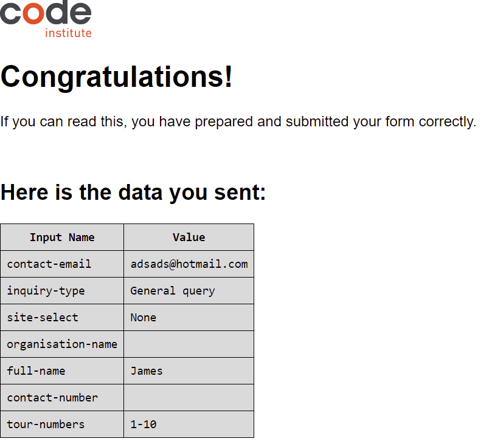
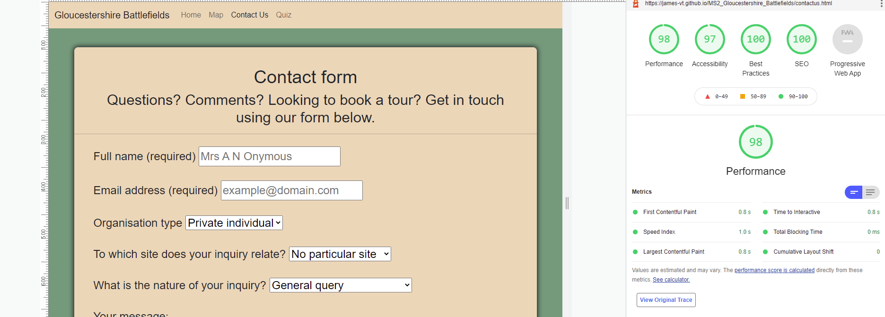
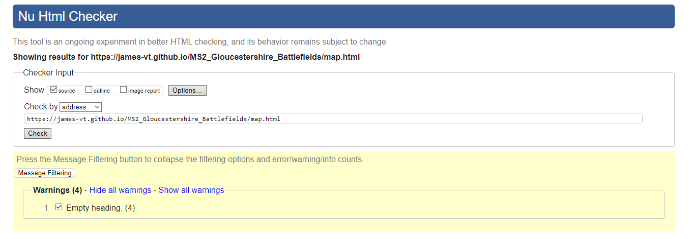
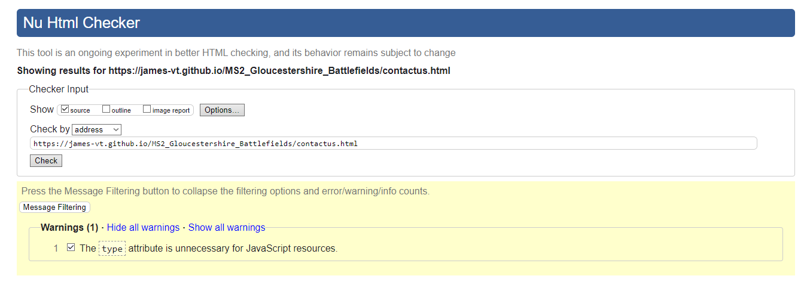
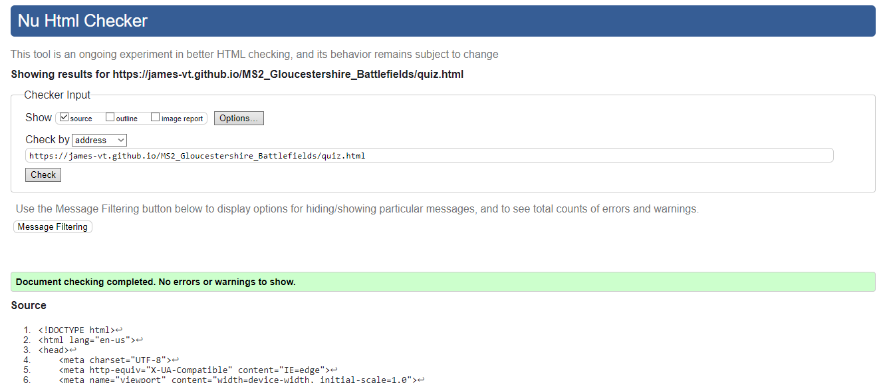

# Testing

### Linked script testing

As you can see in the picture, the first function in my site that I tested was whether the buttons registered a click properly. This was partly to test the buttons themselves, but also to test whether I had correctly linked my JavaScript file to my index.html file. As such, I wrote the code below in battlefields.js:

```
// The below is to test whether this file in linked properly to the index.html file
// and its button elements

let button = document.getElementById("tewkesbury-button");

function buttonTest() {
    console.log("button clicked");
}

button.addEventListener('click', buttonTest);
```

As you can see from the image below of the map page during development, the test was successful.


---

### Quiz data testing

To ensure the correct data was being collected throughout the development of the quiz, I added a number of console.logs to its various functions and arrays. In the screenshot below, you can see how this built up the information towards the end of the quiz. We have the questions, the correct answers and the submitted answers, in that order.


The final outcome of all this is the results table, shown to the player at the end of the quiz. Not only does it display the answers chosen vs. the correct ones, but the message and picture presented to the user are different depending on their score.


Here we can see the player achieved a score of 5/10, and received the message "Oh dear! Retreat!" and a picture of the Zaparozhian cossacks as a result. This is the functionality working as it should.

---

### Contact form validation testing

Here we have an example of the contact form during development:


Using JavaScript, I have added validations to ensure a name and an email address are entered and if they are not entered, I have added funationality that will prevent the form from being submitted. The other fields are less essential, thus do not require validation. Both the Full name and Email address fields have placeholder text to serve as examples. To test whether the validation had worked, I clicked submit before anything was entered. If the validation of these two fields and the arresting of the default function have worked properly, we should see error messages appear above the Submit button.


As you can see from the image above, it worked like a charm. The error messages appear as expected, and the form is unable to submit while error messages are present - in fact the prevention of the default submit feature of the submit button hinges on the fact error messages are present. So what happens when we fulfill the demands of the messages and then click submit?



Result! Here we can see the Code Institute formdump success screen, which confirms submission of the form along with the precise data sent. Success!

---

### Contact form error message removal testing

In the above test, we made sure that the form would not send if the required fields were not filled in and that error messages would display to the user, telling them what they had done wrong. But what if the user later corrected their mistake and submitted the form with the required fields filled in this time? Or what if they correctly filled in a section they had got wrong the first time, but still had a mistake in the other required field? We needed a way of removing the messages in order to keep the feedback of errors up to date. In order to do this, I added splice methods to remove the error messages from the array when corrections had been made. To test this worked, I used a console.log. Below you can see how I made sure it worked:


We can see three entries in the console: firstly, one for each required field not filled in, and then a third for neither having been filled in. Filling in both and clicking submit gives us a successful form submission, same as the last image in the section above. Success!

Addendum: I later added a requirement for the message field as well. Here's the evidence for it working below:


---

## Testing against user stories

I have tested each user story against the various features of the site to ensure that each of them are met in some way.

### First time user stories:

User Story Number | A first time user will want to: | How was this achieved? | Evidence of user story having been met
------ | ------ | ------ | ------
1 | Learn the history of a specific battlefield chosen by interacting with the map. | Clicking the map buttons or functions will feed information onto the page relevant to the selection. | [Map with battle selected via map marker](docs/testing/featuretesting/maptesting.png)
2 | Change the clicked battlefield on the interactive map or from the button menu in order to see information about it feed back on the page, while removing the information from the previous selection. | Selecting a different battlefield will remove the previous selection's info, and feed the new selection's info onto the page. | [Map with battle selected via button](docs/testing/featuretesting/mapbuttontesting.png)
3 | Contact the organisation behind the website, and receive confirmation that their correspondence has been sent. | The contact form facilitates contact between visitors and site owners, and feeds back to confirm successful receipt of correspondence. | (evidence image here)
4 | Test their knowledge with a quiz they can initiate on the subject that feeds back their score. | The quiz is accessed via links in the nav bar and the index page image menu. The quiz itself feeds back user score throughout. | [Quiz question](docs/testing/userstorytesting/userstoryquizexample.png), [quiz answer feedback](docs/testing/userstorytesting/userstoryanswerfeedback.png)
5 | Review their answers to the quiz via feedback, to see where they went wrong if applicable. | A table of results and correct answers is presented to the user at the end of the quiz. | [Results table](docs/testing/userstorytesting/userstoryresults.png)

------
### Site owner stories:

User Story Number | A site owner will want to: | How was this achieved? | Evidence
------ | ------ | ------ | ------
6 | Relay information about the battlefields the charity promotes according to user input. | Map page reveals info depending on user selection. | [Info of a battle once a marker or button has been selected](docs/testing/featuretesting/mapinfotesting.png)
7 | Visually display the locations of battlefields on the interactive map according to user input. | Clicking one of the buttons with the battlefields' name on it or one of the map markers will pan the map to that location. | [Map with battle selected via map marker](docs/testing/featuretesting/maptesting.png), [Map with battle selected via button](docs/testing/featuretesting/mapbuttontesting.png)
8 | Provide the opportunity for visitors to contact the charity via an interactive feedback form. | Contact form allows site owners to receive communication from visitors. | (evidence image here)
9 | Present visitors with a fun and working interactive quiz that feeds back their results. | The quiz presents a user with results at the end, keeps score and presents them with "correct" or "wrong" for each answer given, depending. | [Wrong answer and score](docs/testing/userstorytesting/userstoryanswerfeedback.png), [results](docs/testing/userstorytesting/userstoryresults.png)
10 | Relay to visitors the purpose and nature of the charity. | Information is presented to the user upon landing on the home page, with an option to read more upon interacting with the page. | [Home page intro with optional extra info](docs/testing/userstorytesting/userstoryindex.png)

---

## Bugs

### Race condition bug

A bug I faced when working with the Google Maps API was due to what I later learned was a "race condition." When loading the live page or the port 8000 test page, the map would show on some page loads but not others. When the map failed to load, I noted the following two errors in the console:

```
Uncaught ReferenceError: google is not defined
    at myMap (battlefields.js:40)
    at battlefields.js:53
```

```
Uncaught (in promise) hf {message: "initMap is not a function", name: "InvalidValueError", stack: "Error\n    at new hf (https://maps.googleapis.com/m…yZ-4&callback=initMap&libraries=&v=weekly:160:155"}
```

Thinking at first that this was to do with the restrictions on the API key, I first tried changing those, but this did not work. I then consulted fellow CI students on Slack, which turned up an interesting result. Below is my original HTML code for the Google Maps API:

```
<script
      src="https://maps.googleapis.com/maps/api/js?key=YOUR_API_KEY&callback=initMap&libraries=&v=weekly"
      async
    ></script>
```

As identified by fellow student Sean Young, the attribute of "async" at the end of the script was causing the issue. The reason for this is that async is short for asynchronous loading. This attribute tells the browser to begin loading the next line of code as soon as this one has started loading, instead of waiting for it to finish. This means the script can sometimes load satisfactorily, and sometimes not. It comes down to a race between whether the script containing the API key loads first, or the script that constructs the map loads first. If the former happens, the map loads and works just fine. If not, then the problem I've described is what you're faced with.

#### Problem solved. The solution: remove the async attribute from the HTML.

### Score incrementation bug

While trying to get the score to increment properly on the quiz, I came across an issue whereby the score counter, presented as 0/6 upon the game's initialisation, would merely change to "1" on clicking the first correct answer, "2" on the second, etc.


Upon re-running the code after coming back from eating dinner, it worked perfectly.


#### Problem solved. The solution: do nothing and come back later.

### Hover animation delay/glitch

After adding a mouseenter/mouseleave event handler to my image links in index.html, I noticed that if I moved the mouse too quickly - really not very quickly at all - the animation broke. It would cease to respond to the mouse entering or leaving the element, and if any response came at all it could take up to five seconds after leaving the element to realise the mouse had even entered it. The code looked like this:

```
$(document).ready(function() {
    $(".index-menu-image").mouseenter(function() {
        $(this).animate({opacity: "0.2"});
    $(".index-menu-image").mouseleave(function() {
        $(this).animate({opacity: "1"});
    })
});
```
As you can see, this block of code uses mouseenter and mouseleave. To try something else, I wrote the same bit of code again but this time using a hover event handler instead of mouseenter and mouseleave:

```
$(document).ready(function() {
    $(".index-menu-image").hover(function() {
        $(this).animate({opacity: "0.2"});
    },
    function() {
        $(this).animate({opacity: "1"})
    })
});
```
This allowed me to roll everything into one function, rather than two. This works much better, allowing the animation to react to much quicker movements. If it needs to catch-up, it can now do so without getting broken.

#### Problem solved. The solution: use hover instead of mouseenter/mouseleave.

## Unfixed bugs

### Expression/assignation

An ongoing issue is with this piece of code within the quiz.js file:

```
if (selectedButton.dataset = correct) {
        questionElement.innerText = "Correct!";
        incrementScore();
    } else if (selectedButton.dataset != correct) {
        questionElement.innerText = "Wrong!";
    }
```

This was flagged by JSHint (see: Testing JavaScript with JSHint) as an warning because the first line functions as both conditional expression and assignment. However, attempts to fix this using == or ===, or to put the word correct in quotations, cause the function to fail. As a result, it remains. With more time, I would seek other options to fix this but the functionality itself works, I have allowed it to stand for now.

### WAVE index.html results

We also have the unsolved issue of index.html's unresolved contrast issues. See below for details. I consider this is an unfixed bug rather than an error of WAVE's part because it is more likely down to my inexperience than a machine error. But as WAVE will not tell me where the issues actually are on the page, I cannot fix them for now.

---

## Testing pages with Lighthouse

https://developers.google.com/web/tools/lighthouse

* Lighthouse is a validator built into Google Chrome, used for testing the performance, accessibility, best practice and more of a web page. Specifically I have used it to make sure all my pages are above the 80% mark in performance.

* To use Lighthouse, you can download Google Chrome web browser and use it from there or use one of the alternative options in the link above. Personally, I used Chrome. Right click on any web page, choose the bottom "inspect" option and click it. Then, in the dev tools that open up, the top bar will have a symbol of two little arrows. Select this, and you'll see Lighthouse at the bottom. Open it up from there, and click generate report. Voila.

### Lighthouse test for index.html


### Lighthouse test for quiz.html


### Lighthouse test for map.html


The Lighthouse test for map.html flagged an error to the console, hence the slightly lower "best practices" score than I would've liked. A member of the Code Institute team (Eventyret_mentor) informed me that this is currently an unavoidable problem with Chrome to do with favicon, he believes.

### Lighthouse test for contactus.html



### Lighthouse test for 404.html


---

## Testing JavaScript with JSHint.

The JavaScript files used in this project were tested using JSHint (link in README, technologies used section).

### index.js testing


No issues were detected in Index.js.

### quiz.js testing


A single issue was flagged with quiz.js: that of the combined conditional expression and assignment in the chooseAnswer function. This is addressed in a comment above that particular section in the file itself. The code will not work without doing both, so has been kept as it is (see also: unfixed bugs).

### battlefields.js testing


One warning remains on this one, about a function declared within a loop possibly leading to confusing semantics. With the names things have been given, confusion should be avoided, and this is a known approach to using Google Maps API. The same goes for the undefined variables - due to the use of the API here necessetates this.

### contactus.js testing


Three warnings and two instances of an undefinded variable remain in this file. JSHint appears to read "errorMessage.splice[i, 1]" as an expression rather thasn as a function. I have not tried to change these, as the file's functionality works fine with them there. Similarly, the undefined variable is emailjs which is used throughout with the API.

## WAVE testing

https://wave.webaim.org/

WAVE stands for Web Accessibility Evalutation Tool. While it has its limits, it can be useful for judging the accessibility of a site for individuals with disabilities. I tested each page against it.


Our first result is an example of why it can be imperfect. It shows the page as still having four contrast errors but cannot tell me where these ones are. On first attempt it showed seven and was able to identify three of them, which I removed. But as the other four do not show, there isn't much I can do. It also shows four alets. Three of these are suggestions for where headings could go - in this case, in our image links below the carousel. I do not need them there, so can ignore these. It has a point about the redundant link, but the ability to highlight the "Home" link and set it as active to assist screenreaders means it's more useful to keep it than get rid of it.


The results for the map page are even worse. What's frustrating here is not that the missing alternative text warnings won't tell me where they are on the page. I can assume it is referring to the map markers (of which there are six, not nine). However, the map markers do have text to explain what they refer to. Again, perhaps this is my lack of experience but as it won't show me where the issue is, I am uncertain how to fix this. The same is true of the empty headings (which are not empty once a battlefield is selected, as the placeholder text makes clear). Of the alerts, the same must be said - it is not made clear where these problems are on the page.


## Jigsaw
https://jigsaw.w3.org/css-validator/

Jigsaw is used to validate CSS. Below are the results of style.css in this project.


## NuHTML
https://validator.w3.org/nu/

NuHTML is used to check HTML for best practices. I have used it to validate the HTML of my site.

### Index.html results in NuHTML


The only problem our index html had was that it showed an error for favicon's use of rel="icon," which NuHTML didn't like. However, the favicon doesn't show without it and it does not effect the user experience so it stays.

### map.html results in NuHTML



For our map page, the icon problem was repeated and will continue to be ignored. It also flagged problems with the empty headings in the area that is filled with the map information upon clicking a marker or a button. As these fields are filled user interaction and this is explained in the text of the page, we can move on.

### contacus.html results in NuHTML



Same favicon problem again. This time we also have a warning that the type attribute isn't necessary. It may not be necessary for functionality, but I consider it helpful for explaining to a co-developer what it does and what it links to, so I see more reason to keep it.

### quiz.html results in NuHTML



Other than the predictable favicon objection, we have no problems on the quiz.html page.

